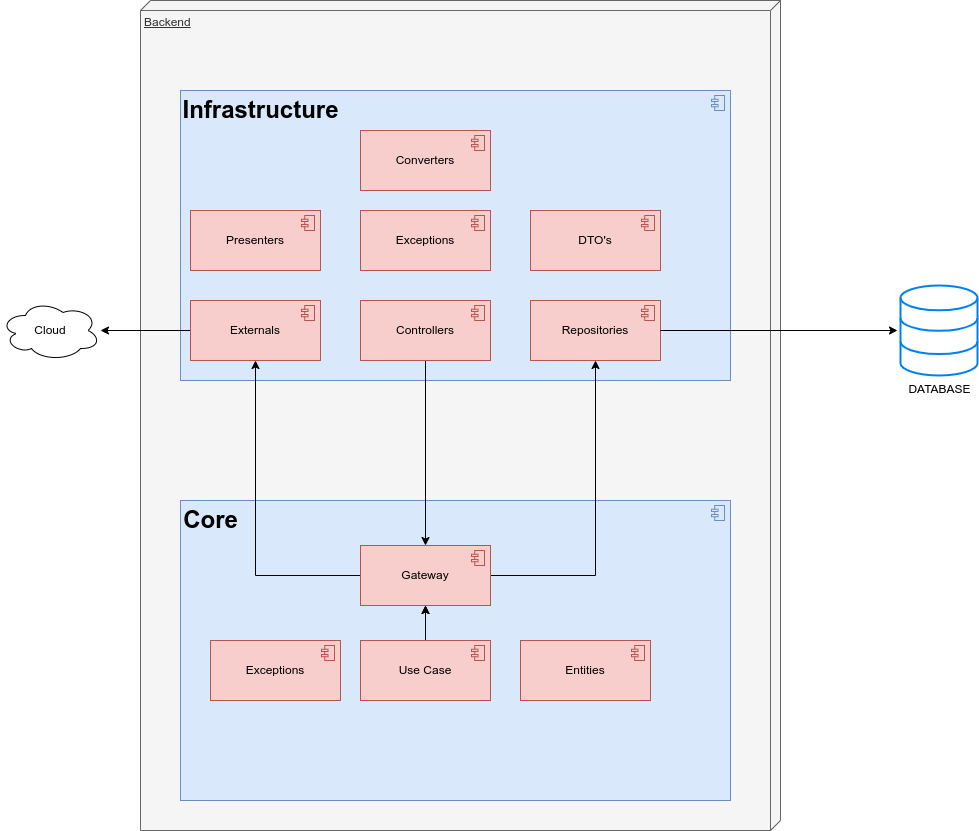
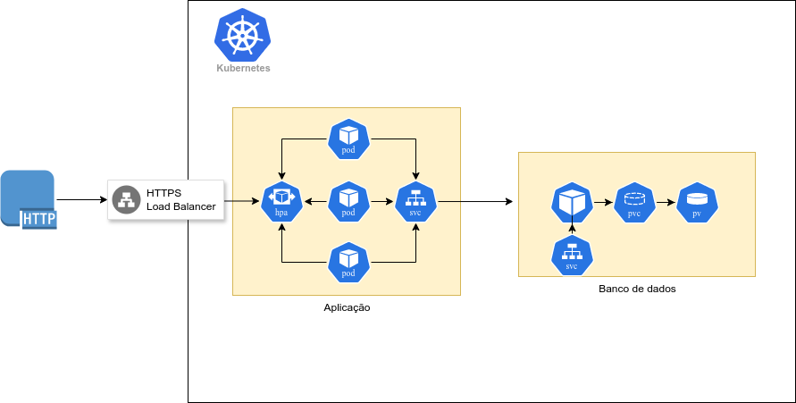

# Sistema de Pedidos

Este projeto é um sistema de pedidos, projetado para atender às necessidades de restaurantes de fast food. Ele permite que os usuários façam pedidos de alimentos e bebidas, acompanhem o status de seus pedidos e realizem o pagamento online.

## Docker Setup - Ambiente local

### Requisitos para execução local

- **Docker**: Para instalar o Docker, siga as instruções no [site oficial](https://docs.docker.com/get-docker/).
- **Docker Compose**: Para instalar o Docker Compose, siga as instruções no [site oficial](https://docs.docker.com/compose/install/).

As imagens utilizadas para a construção e execução da aplicação foram escolhidas com base na compatibilidade com processadores AMD e ARM.

### Execução
O projeto inicialmente foi desenvolvido para ser executado em um cluster local como minikube ou similares.

Na raiz do projeto acesse a pasta `/k8s` 

Execute os comandos na seguinte ordem
```bash
kubectl apply -f metrics.yaml
kubectl apply -f config-map-postgres.yaml
kubectl apply -f svc-fast-food-banco.yaml
kubectl apply -f svc-fast-food-api.yaml
kubectl apply -f postgres-pv.yaml
kubectl apply -f postgres-pvc.yaml
kubectl apply -f pod-fast-food-banco.yaml
kubectl apply -f pod-fast-food-api.yaml
kubectl apply -f hpa-fast-food-api.yaml
```
Aguarde até que o Probe de leitura esteja em `Ready` e acesse a aplicação através do endereço `http://localhost:30080/swagger-ui/index.html`

Troque localhost pelo IP do seu cluster.

É possível obter o IP do cluster através do comando
```bash
kubectl cluster-info
```

[Documentação Swagger](http://localhost:30080/swagger-ui/index.html)

Porta Aplicação: 30080

Porta Banco de dados: 30000

### Definição do docker compose

#### Etapa de Construção

1. Utiliza a imagem `maven:3.8-openjdk-17` como base.
2. Define o diretório de trabalho para `/app`.
3. Copia todos os arquivos do diretório atual para `/app`.
4. Executa o comando `mvn clean install -DskipTests` para compilar a aplicação, pulando os testes.

#### Etapa de Execução

1. Utiliza a imagem `openjdk:17` como base.
2. Define o maintainer do projeto como "Grupo 47".
3. Define o diretório de trabalho para `/app`.
4. Copia o artefato gerado na etapa de construção para o diretório de trabalho.
5. Define o comando de entrada para executar o jar da aplicação.
6. Expõe a porta `8080` para acesso externo.

## Tecnologias Utilizadas

Este projeto utiliza várias tecnologias para o desenvolvimento, teste e execução da aplicação. Abaixo estão listadas as principais tecnologias utilizadas:

- **Java 17**: A linguagem de programação principal utilizada no projeto.
- **Spring Boot 3.2.5**: Um framework popular para desenvolvimento de aplicações Java.
- **Maven**: Uma ferramenta de automação de compilação e gerenciamento de dependências para projetos Java.
- **Lombok**: Uma biblioteca que automatiza a geração de código repetitivo em projetos Java.
- **PostgreSQL**: Um sistema de gerenciamento de banco de dados relacional.
- **Git**: Um sistema de controle de versão distribuído para gerenciar o código fonte do projeto.
- **Docker**: Uma plataforma para desenvolver, enviar e executar aplicativos em contêineres.
- **docker-compose**: Uma ferramenta para definir e executar aplicativos Docker de vários contêineres.
- **Flyway**: Uma ferramenta de migração de banco de dados que permite evoluir facilmente o esquema do banco de dados ao longo do tempo.


Essas tecnologias combinadas oferecem um ambiente de desenvolvimento robusto e eficiente para a construção e execução da aplicação.

## Funcionalidades

O sistema é composto por várias funcionalidades, incluindo:

- Criação de pedidos: Os usuários podem criar novos pedidos, adicionando itens de um menu pré-definido.
- Acompanhamento de pedidos: Os usuários podem acompanhar o status de seus pedidos em tempo real.
- Pagamento online: Os usuários podem realizar o pagamento de seus pedidos online, através de várias opções de pagamento.

## Controladores

O sistema é composto por três controladores principais:

- `ClienteController`: Responsável por lidar com as solicitações HTTP relacionadas ao Cliente.
- `ProdutoController`: Responsável por lidar com as solicitações HTTP relacionadas ao Produto.
- `PedidoController`: Responsável por lidar com as solicitações HTTP relacionadas ao Pedido.
- `PagamentoController`: Responsável por lidar com as solicitações HTTP relacionadas ao Pagamento.

Cada controlador tem vários métodos que correspondem a diferentes endpoints da API. Para mais detalhes sobre cada controlador e seus métodos, consulte a documentação do swagger.

Para testar a aplicação importe o arquivo `fast-food-api.postman_collection.json` no Postman.

## Collection postman com todos os endpoints desenvolvidos
A collection se encontra na raiz do projeto, no arquivo chamado `fast-food-api.postman_collection.json`

[Link para a collection](https://github.com/Weiller/fast-food-api/blob/master/fast-food-api.postman_collection.json)

## Vídeo de apresentação do projeto
[Link para o vídeo](https://www.youtube.com/watch?v=mDb12TgbVA8)

## Desenho de arquitetura


## Desenho de infraestrutura
